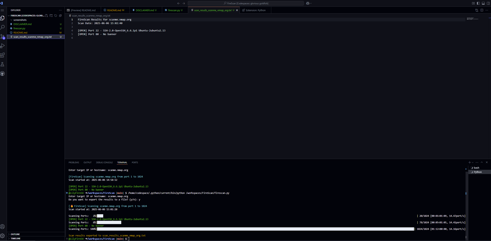

# 🔥 FireScan — Custom Port Scanner

FireScan is a lightweight Python-based port scanner built to demonstrate cybersecurity and scripting skills. It scans a given IP address or hostname for open TCP ports and attempts basic banner grabbing for service information.

## ⚙️ Features
- Scan any IP address or hostname
- Identify open TCP ports (default: ports 1–1024)
- Basic service banner grabbing
- Export scan results to a text file
- Clean CLI output with color and a progress bar

## 🚀 How to Use
1. Clone the repo:
git clone https://github.com/LilyFire54/FireScan
cd firescan

2. Install dependencies:
pip install tqdm colorama

3. Run the scanner:
python firescan.py

4. Follow the prompts:
Enter the target IP or hostname.
Choose whether to export results to a file.

🛡️ Disclaimer
FireScan is intended for educational purposes and personal portfolio demonstration only.
Unauthorized scanning of systems or networks without explicit permission is illegal and unethical.

By using this tool, you agree to:

Only scan systems you own or have written permission to scan.

Use FireScan responsibly and in compliance with all applicable laws and regulations.

⚠️ The author assumes no responsibility for any misuse or damage caused by this tool.

Please read the full disclaimer for more details.

## 📚 License
This project is licensed under the MIT License — see the [LICENSE](./LICENSE) file for details.
